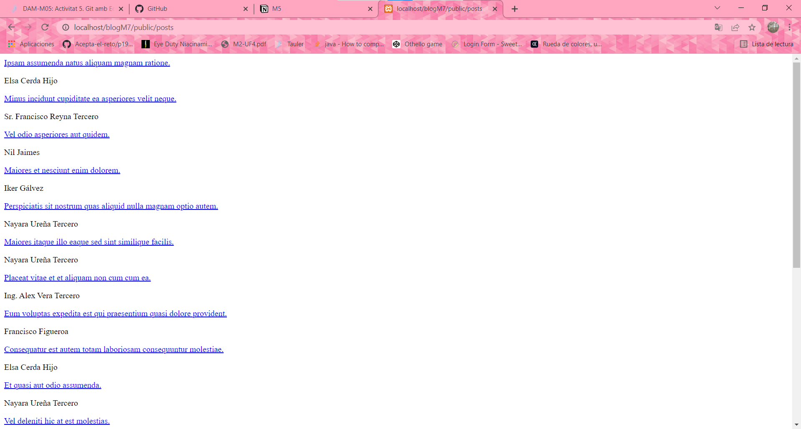
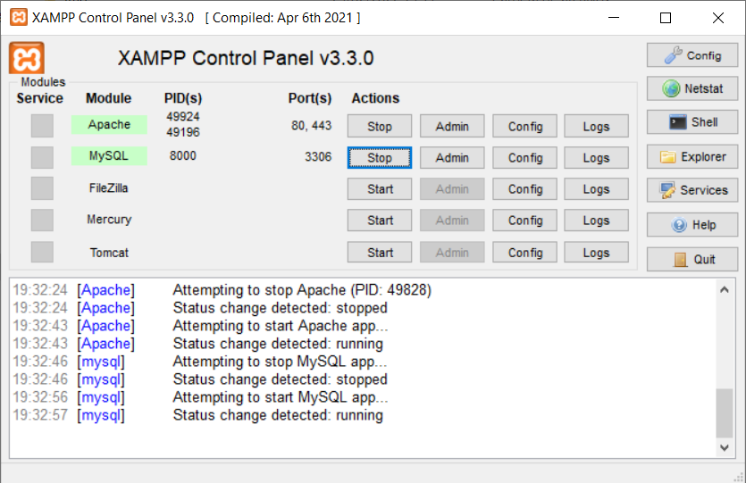
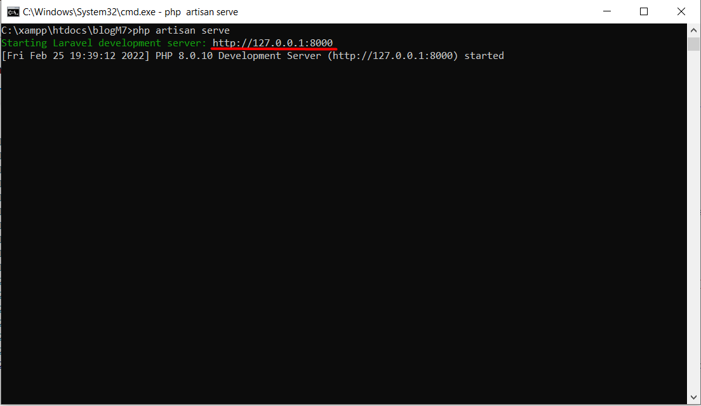

<p align="center"><a href="https://laravel.com" target="_blank"></a></p>

<p align="center">
<a href="https://travis-ci.org/laravel/framework"></a>
<a href="https://packagist.org/packages/laravel/framework"></a>
<a href="https://packagist.org/packages/laravel/framework"></a>
<a href="https://packagist.org/packages/laravel/framework"></a>
</p>

## What does this blog do?
This simple laravel blog shows a post with it's author:



And when you access to the post, you can see a brief description, the author's name and some comments from different users:


## How can we deploy it?
To deploy the blog in our local environment, we'll have to use xampp. If you don't have it, you can install it [here](https://www.apachefriends.org/download.html).
Once you have it installed, open the Xampp Control Panel and start *Apache* and *MySql*.



Then you'll need to download the blog in the **_htdocs_** folder, which you'll find in *C:\xampp*
Now, yo'll just have to open a command prompt in the blog folder and type ```php artisan serve``` to start the blog and go to the showed address:



Finally, to this address you'll have to add **_/posts_**, so it will look like this: thegeneratedaddress/posts. In my case:http://127.0.0.1:8000/posts
